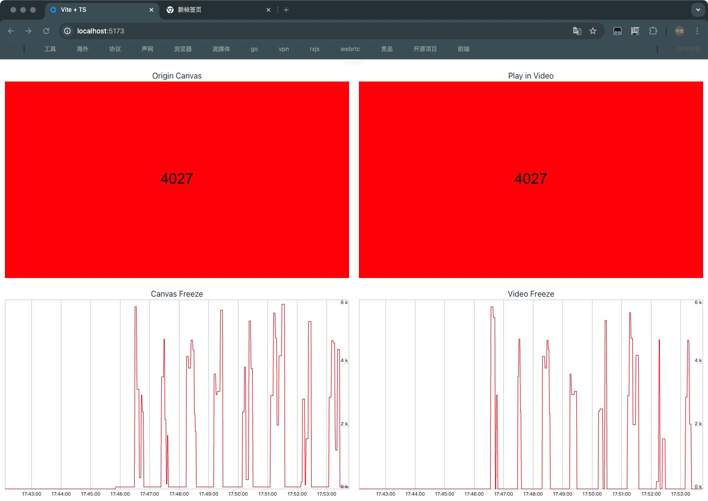

# TotalFreezeDuration In Web

Perfect replica of webrtc [totalFreezeDuration](https://www.w3.org/TR/webrtc-stats/#dom-rtcinboundrtpstreamstats-totalfreezesduration)

## Example image:



## Using

```ts
const observer = new VideoQualityObserver();
const video = document.querySelector<HTMLVideoElement>("#player")!;
if (video) {
  const vfc = (timeStamp: number, metadata: VideoFrameCallbackMetadata) => {
    observer.OnRenderedFrame(timeStamp, metadata);
    video.requestVideoFrameCallback(vfc);
  };

  video.requestVideoFrameCallback(vfc);
}
```

## build

yarn

yarn build

## dev

yarn

yarn dev

**Any questions you can contact me at [ltsg0317@outlook.com](mailto:ltsg0317@outlook.com)**
